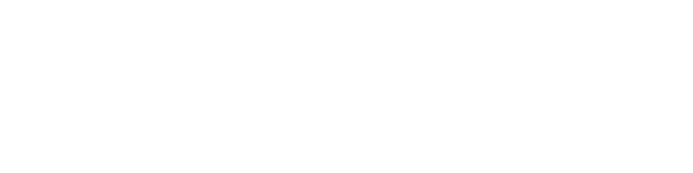

  

# Picons Movistar Plus+ 2026 | Enigma2

[cite_start]Proyecto hecho con la intención de ofrecer unos logos de canales actualizados, limpios y estéticos para mejorar la interfaz de tu decodificador.

## Características

* [cite_start]**Formato:** .png 
* [cite_start]**Nombres:** Basados en programación oficial de Movistar Plus+ 
* [cite_start]**Resolución:** 800 x 400

## Capturas 

  
  
  

(Imágenes que te acabo de pasar)

##  Sugerencias
Si falta algún canal nuevo o hay un cambio de frecuencia, contacta a mi Reddit: @AdGrouchy2110

**Autor:** AdGrouch